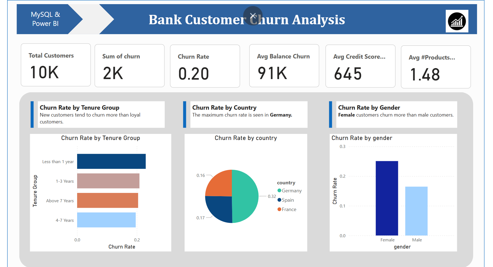
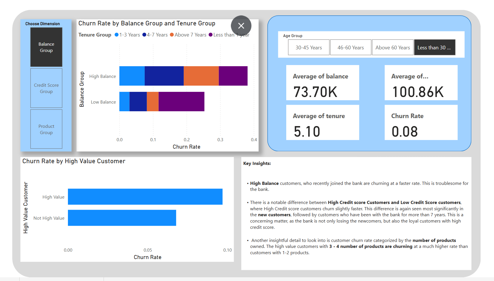

# Bank-Data-Churn-Analysis
This file performs churn analysis for bank data and creates visualizations.

## Introduction

All businesses require analysis of their customer engagement and how it can be improved. An important term to study in this process is the customer churn rate, which indicates the rate at which customers stop engaging with a business against the total number of customers engaged with the business. The main goal of this analysis is to decrease the churn rate via analytical decision-making, which involves identifying churn drivers and trying to ameliorate them.

### Tools Required
1.	Power BI
2.	Power Query

### Sample Datasets
1.	Bank Data
2.	Telecom Company Data
3.	E-commerce Website Data

## Power BI Dashboard

